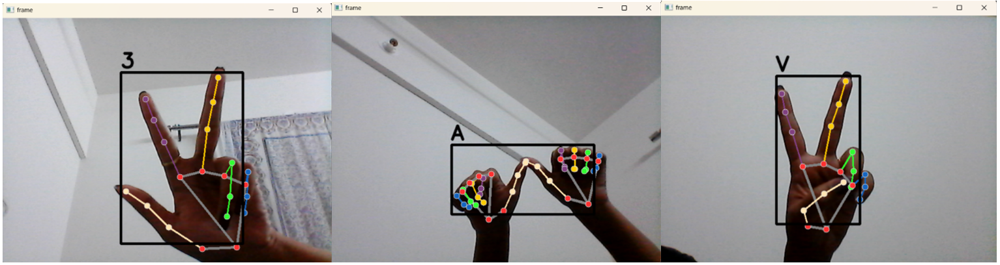

# Indian-Sign-Language-Detection-using-Mediapipe

This project is designed to recognize Indian Sign Language (ISL) gestures using hand landmarks detected from images and real-time video. The goal is to create a system that can interpret ISL gestures, which are commonly used by the deaf and hard-of-hearing community in India, and translate them into meaningful output. The project leverages computer vision and machine learning techniques to detect hand gestures, process them, and predict the corresponding letters or numbers in real-time.

### ISL for number 3, alphabet A and alphabet V:

### Signs recognized by the model:

## Dataset : 
The dataset consists of over 36,000 images, categorized into gestures representing various characters of the ISL alphabet and numbers.
https://drive.google.com/drive/folders/1j0CdSLnw_4A8N8-RqzAH2k2J7XnRQDWQ?usp=drive_link

## Dependencies : 
Ensure you have the required libraries installed - mediapipe, opencv-python, scikit-learn, keras, numpy, pickle.

## Usage:
Preprocessing: Run preprocess.py to generate the data.pickle file from your ISL gesture images.
Training: Run train_model.py to train the model and save it as model.p.
Inference: Run inference.py to perform real-time gesture recognition using your webcam.

The project is divided into three main components:

### preprocess.py :
1. Purpose: Preprocesses a dataset of ISL gesture images.
2. Process: Uses Mediapipe, a powerful hand-tracking library, to detect hand landmarks in each image. The script normalizes the landmark coordinates to ensure consistency and saves the processed data along with labels into a data.pickle file.
3. Output: A serialized dataset (data.pickle) containing normalized hand landmark data and corresponding labels, ready for training.

### train_model.py : 
1. Purpose: Trains a machine learning model for ISL gesture recognition.
2. Process: Loads the preprocessed data, pads sequences to ensure uniform input size, splits the data into training and testing sets, and trains a Random Forest classifier—a robust machine learning algorithm for classification tasks.
3. Evaluation: The script evaluates the model's performance using metrics such as accuracy, precision, recall, and F1-score, providing insights into how well the model can recognize different ISL gestures.
4. Output: A trained model saved as model.p, which can be used for real-time gesture recognition.

### inference.py :
1. Purpose: Performs real-time ISL gesture recognition using a webcam.
2. Process: Captures live video from the webcam, detects hand landmarks using Mediapipe, processes the landmarks, and predicts the gesture using the trained model. The predicted gesture is displayed on the video feed in real-time.
3. Output: A live video feed with the recognized ISL gesture overlaid on the screen, allowing users to interact with the system in real-time.

## Why This Project?
This project is a step towards bridging the communication gap between the deaf and hearing communities by providing a tool for real-time ISL gesture recognition. It demonstrates how computer vision and machine learning can be used to create accessible and inclusive technology. Whether you're a developer, researcher, or someone interested in sign language, this project offers a practical and educational example of how to build a gesture recognition system from scratch.

By following the steps in this repository, you can train your own ISL gesture recognition model and deploy it for real-time use, making it a valuable tool for educational, assistive, or research purposes.
